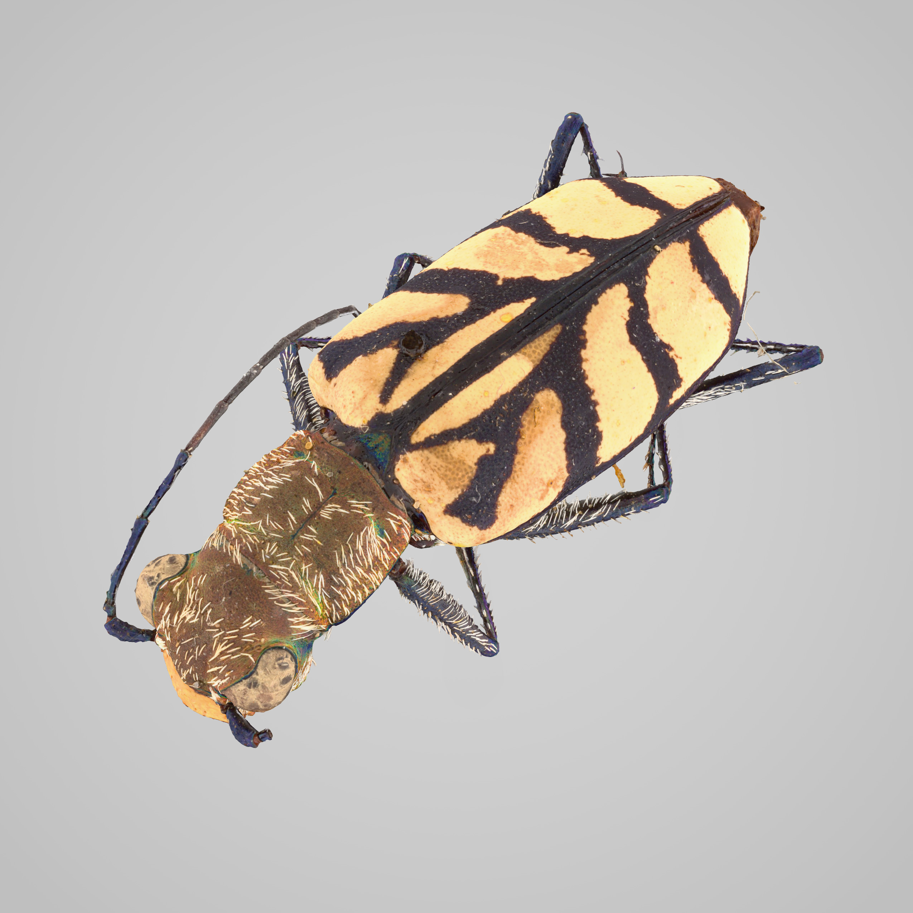
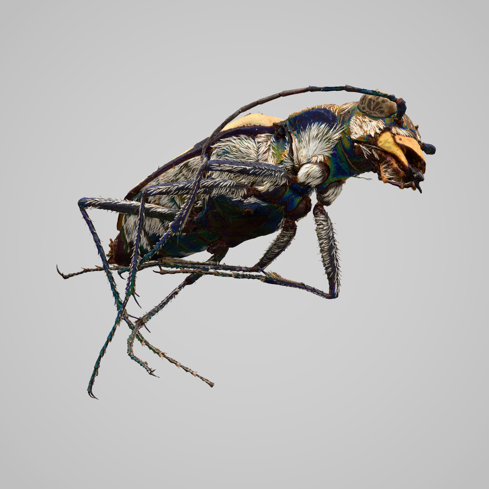
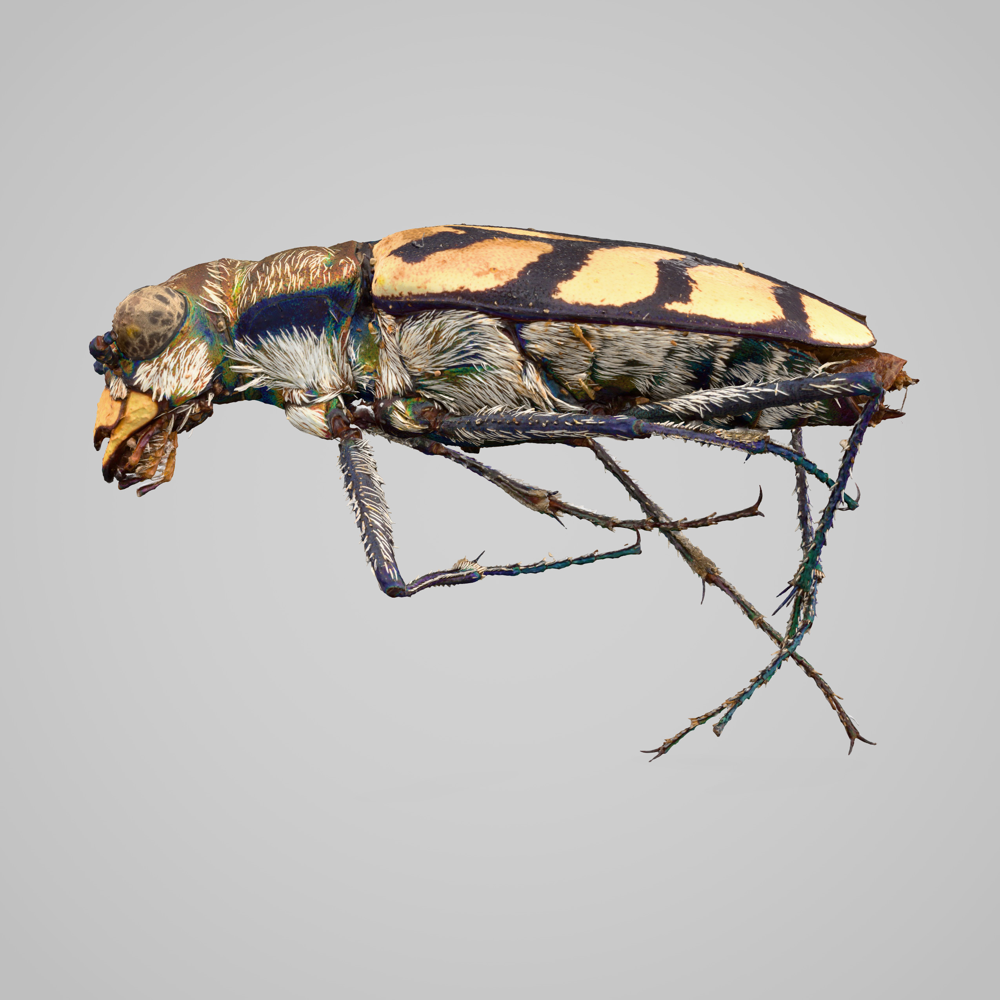

## Create Preview
The `create_preview` project creates three predetermined pictures of the glb models. This is allows for an easy quality control. The current implementation uses a flask server. The extracted images all have a black background. To change this we use a Photoshop automation which automatically adds a white background with a subtle gradient and then exports the file again as a JPEG-file. In the end we have three images:

|top-view|bottom_view|side-view|
|---|---|---|
||||

This can be used in combination with [Extract Images](#️extract-images) to quickly assess the quality of the glb files.

### Instructions

To run this script, ensure you have Flask installed and access to a web browser.

1. Go to the `create_preview` folder.
2. Update the script by replacing `static_folder` with the path to the folder containing your projects. 
3. Move the `main.js` file to the path given above.
4. Start the Flask server using one of the following commands, depending on your Flask installation:`python3.12.exe -m flask --app app run`or`flask --app app run`
5. Open [`localhost:8000`](http://localhost:8000/) in your web browser and press "Start". The program will then automatically capture images of the 3D model from three different perspectives. The images will be saved to your Downloads folder. Make sure your browser is in the foreground the entire time.